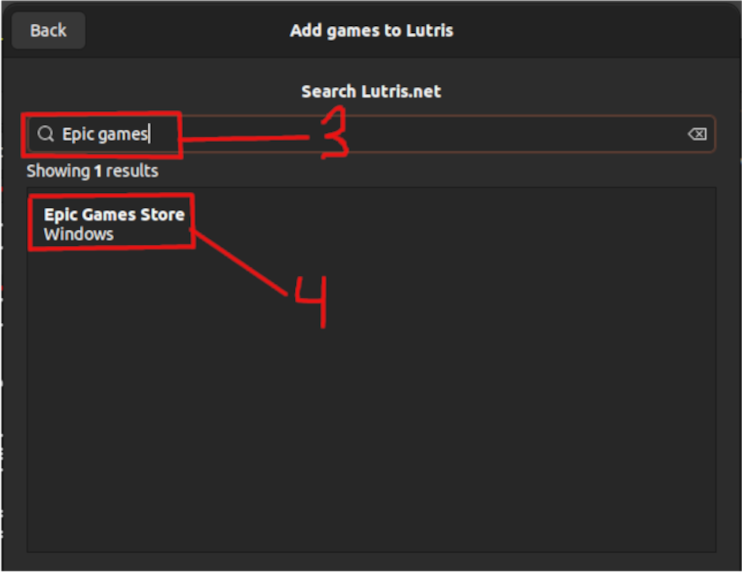
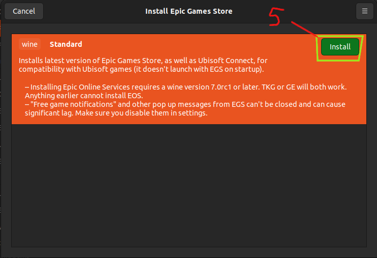

# What is this Readme about?

This Readme is a guide on how to install and use the AirSim plugin for Unreal Engine 5.2. It will cover installation and configuration for Drone piloting.

# Table of Contents

- [Linux Ubuntu 20.04 installation guide](#linux-ubuntu-2004-installation-guide)
  - [FYI: you will need around 100 GB of free space on your hard drive for Unreal Engine and the project.](#fyi-you-will-need-around-100-gb-of-free-space-on-your-hard-drive-for-unreal-engine-and-the-project)
  - [1. Register a EpicGames account and connect it to your GitHub account.](#1-register-a-epicgames-account-and-connect-it-to-your-github-account)
  - [2. Download the source file for Unreal Engine latest release via git](#2-download-the-source-file-for-unreal-engine-latest-release-via-git)
  - [3. Setup Installation Unreal Engine](#3-setup-installation-unreal-engine)
  - [4. Installation Unreal Engine (takes a while)](#4-installation-unreal-engine-takes-a-while)
  - [5. Test that everything is fine (will take time the first time)](#5-test-that-everything-is-fine-will-take-time-the-first-time)
  - [(Optional) Installing Epic Games Launcher for access to Unreal Market Place for assets](#optional-installing-epic-games-launcher-for-access-to-unreal-market-place-for-assets)
    - [1. Install lutris for installing and launching epic games launcher](#1-install-lutris-for-installing-and-launching-epic-games-launcher)
    - [2. Launch lutris](#2-launch-lutris)
    - [3. Add Epic Games Launcher](#3-add-epic-games-launcher)
    - [4. Install Epic Games Launcher](#4-install-epic-games-launcher)
    - [5. Link the Epic Games Launcher to your Unreal Engine Project](#5-link-the-epic-games-launcher-to-your-unreal-engine-project)
    - [6. Open the Epic Games Launcher and you should see your project in the Unreal Engine library.](#6-open-the-epic-games-launcher-and-you-should-see-your-project-in-the-unreal-engine-library)
  - [Installing AirSim](#installing-airsim)
- [Windows 11 installation guide](#windows-11-installation-guide)s
  - [Installing Unreal Engine 5.2](#installing-unreal-engine-52)
  - [Visual Studio 2022 installation guide](#visual-studio-2022-installation-guide)
  - [Installing AirSim](#installing-airsim)
- [Launching the plugin in Unreal Engine](#launching-the-plugin-in-unreal-engine)
- [Configuration of the plugin](#configuration-of-the-plugin)

# Linux Ubuntu 20.04 installation guide

### FYI: you will need around 100 GB of free space on your hard drive for Unreal Engine and the project.

### 1. Register a EpicGames account and connect it to your GitHub account.

#### So you can access Unreal Engine source code. [How](https://www.unrealengine.com/en-US/ue4-on-github)

### 2. Download the source file for Unreal Engine latest release via git

```bash
cd ~
git clone -b 5.2 git@github.com:EpicGames/UnrealEngine.git
cd UnrealEngine
```

### 3. Setup Installation Unreal Engine

```bash
./Setup.sh
./GenerateProjectFiles.sh
```

### 4. Installation Unreal Engine (takes a while)

```
nproc
# cores = result of nproc - 1
# use -jcores only if the cores >=7 otherwise do just make
make -jcores
```

### 5. Test that everything is fine (will take time the first time)

```bash
cd Engine/Binaries/Linux
./UnrealEditor
```

#### Create an example project to get a feel.

## (Optional) Installing Epic Games Launcher for access to Unreal Market Place for assets

### 1. Install lutris for installing and launching epic games launcher

```bash
sudo apt-get install wget
wget -O - https://github.com/lutris/lutris/releases/download/v0.5.16/lutris_0.5.16_all.deb | sudo dpkg -i
sudo apt update
sudo apt install lutris
```

### 2. Launch lutris

```bash
lutris
```

### 3. Add Epic Games Launcher




### 4. Install Epic Games Launcher



#### You must specify where you want to install the app. I recommend creating a separate directory for it ~/EpicGames

#### You dont need to create steam shortcut, the other options are up to you.


#### Now click install and follow the installation guide.


#### After installation, you can launch the Epic Games Launcher and login with your account.

#### FYI: OAuth may not work, so you may need to use your email and password to login.


### 5. Link the Epic Games Launcher to your Unreal Engine Project

```bash
cd ~/EpicGames//drive_c/users/{your_username}/Documents
ln -sf ~/Documents/Unreal\ Projects/ ./
```

#### FYI: if ~/Documents/Unreal\ Projects/ is not the path to your Unreal Engine project, you need to change it. But the name of the link should be Unreal Projects.

### 6. Open the Epic Games Launcher and you should see your project in the Unreal Engine library.


## Installing AirSim

### 1. Downloading the repo

```bash
cd ~
git clone https://github.com/CodexLabsLLC/Colosseum.git AirSim
cd Airsim
```

#### this is a successor of Microsoft AirSim which was abandoned

### 2. Replace outdated installation files with the ones in replace Dir

```bash
cp -f {/path/to/this/repo}/replace/cmake/cmake-modules/CommonSetup.cmake ./cmake/cmake-modules
cp -f {/path/to/this/repo}/replace/ros2/src/airsim_ros_pkgs/CMakeLists.txt ./ros2/src/airsim_ros_pkgs
cp -f {/path/to/this/repo}/replace/build.sh ./
cp -f {/path/to/this/repo}/replace/setup.sh ./
```

### 3. Run the setup and build

```bash
./setup.sh
./build.sh
```

# Windows 11 installation guide

## Installing Unreal Engine 5.2

### 1. Register a EpicGames account and connect it to your GitHub account.

### 2. Download the epic games launcher and install it.

### 3. Install Unreal Engine 5.2 via the Epic Games Launcher.

## Visual Studio 2022 installation guide

### 1. Install Visual Studio 2022

#### You can download it from the official website. [Visual Studio 2022](https://visualstudio.microsoft.com/de/vs/)

#### You will need to install the following packages:

- Desktop development with C++
- Game development with C++
- .NET Desktop development
- python development

#### On top of that make sure to install the following packages in the individual components tab:

- .Net SDK latest version
- Windows 10 SDK 10.0.18362.0 (Important for this exact version for Unreal Engine)

### 2. Create a new project in Unreal Engine and open it.

### Use a blank template for a game project.

### 3. Create a new empty C++ class that inherits from None and save it.

## Installing AirSim

### 7. Install AirSim

#### Important: Make sure you only have Visual Studio 2022 installed and no other versions of Visual Studio because the installation will fail otherwise.

#### 7.1 Clone the AirSim repo

```powershell
git clone https://github.com/CodexLabsLLC/Colosseum.git AirSim
```

#### 7.2 Open Developer Command Prompt for Visual Studio 2022

Press the windows key and type "Developer Command Prompt for Visual Studio 2022" and run it as administrator.

Note: we are using the Developer Command Prompt for Visual Studio 2022 because it ensures that the correct windows sdk and .net sdk are used.

#### 7.3 Navigate to the AirSim folder

```powershell
cd AirSim
```

#### 7.4 Run the build script

```powershell
build.cmd
```

### 8. Copy the Unreal\Plugins folder to your Unreal Engine project.

### 9. Udpate your .uproject file to contain the following lines:

```json
{
    .........

  "TargetPlatforms": [
        "MacNoEditor",
        "WindowsNoEditor"
    ],
    "Plugins": [
        {
            "Name": "AirSim",
            "Enabled": true
        }
    ]
}
```

### 10. ADD the following line to Config/DefaultGame.ini file:

```ini
...

+MapsToCook=(FilePath="/AirSim/AirSimAssets")
```

### 11. Generate Visual Studio project files

#### right click on the .uproject file and select "Generate Visual Studio project files"

Note: on windows 11 you must click on "show more options" to see the option.
if you dont see the option restart your computer and try again.

### 12. Open the project in Visual Studio 2022 and build the project.

Select Debug Game Editor and Win64 and click on the green arrow to build the project(F5 also works).


Note: if you get an error about mismatch between versions of AirSim and Unreal Engine it means that the AirSim was not installed with the correct windows sdk. To fix this you need to delete the AirSim folder and repeat the installation process.

# Launching the plugin in Unreal Engine

### 1. Open the project in Unreal Engine

### 2. Open World Settings panel and set the GameMode Override to AirSimGameMode


### 3. Place a PlayerStart actor in the level and hit run.


#### You should have a prompt to select a car or a drone. click NO for drone and YES for car.

#### Note: this step is necessary because it creates the settings.json file in the AirSim folder that should be in the root of the home folder of the current user.
